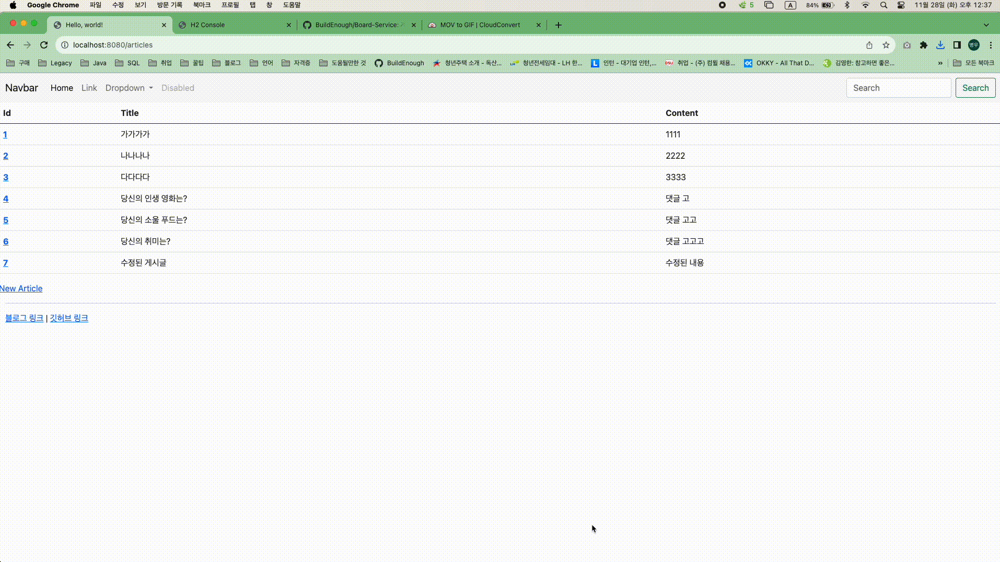

# Board-Service
게시판 프로젝트

<br>

# 1. 개요
프로젝트 명: Board Service  
개발 인원: 1명  
기간: 2023.11.24 ~ 2023.11.28  
주요 기능: 게시글 생성/조회/수정/삭제와 댓글 생성/조회/수정/삭제  
기술: Java, SpringBoot, Mustache, JavaScript, Lombok, REST API, SQL, HTML, Bootstrap  
DB: H2 Database  
Packaging: Jar  
Dependencies: Spring Web, JPA, H2 Database, Mustache, Lombok

<br>

# 2. 개발도구
개발 언어: JAVA  
프레임 워크: Spring Boot  
통합 개발 환경(IDE): IntelliJ(Community version)  
DB: H2 Database  
View template: Mustache  
DB 접근 기술 JPA  

<br>

# 3. 더미 데이터
src > main > resources > data.sql  
```sql
INSERT INTO ARTICLE(TITLE, CONTENT) VALUES('가가가가', '1111');
INSERT INTO ARTICLE(TITLE, CONTENT) VALUES('나나나나', '2222');
INSERT INTO ARTICLE(TITLE, CONTENT) VALUES('다다다다', '3333');


INSERT INTO article(title, content) VALUES('당신의 인생 영화는?', '댓글 고');
INSERT INTO article(title, content) VALUES('당신의 소울 푸드는?', '댓글 고고');
INSERT INTO article(title, content) VALUES('당신의 취미는?', '댓글 고고고');


INSERT INTO comment(article_id, nickname, body) VALUES(4, 'Park', '굿 윌 헌팅');
INSERT INTO comment(article_id, nickname, body) VALUES(4, 'Kim', '아이 엠 샘');
INSERT INTO comment(article_id, nickname, body) VALUES(4, 'Choi', '쇼생크 탈출');

INSERT INTO comment(article_id, nickname, body) VALUES(5, 'Park', '치킨');
INSERT INTO comment(article_id, nickname, body) VALUES(5, 'Kim', '샤브샤브');
INSERT INTO comment(article_id, nickname, body) VALUES(5, 'Choi', '초밥');

INSERT INTO comment(article_id, nickname, body) VALUES(6, 'Park', '조깅');
INSERT INTO comment(article_id, nickname, body) VALUES(6, 'Kim', '유튜브 시청');
INSERT INTO comment(article_id, nickname, body) VALUES(6, 'Choi', '독서');
```

<br>

# 4. 기능 구현
게시글 생성  


<br>

게시글 수정  


<br>

게시글 삭제  


<br>

댓글 생성  


<br>

댓글 수정  


<br>

댓글 삭제  


<br>

# 5. 오류
[한글 깨짐 현상](https://build-enough.tistory.com/343)  

<br>

[더미 데이터 생성 시 발생하는 오류](https://build-enough.tistory.com/344)

<br>

[고유 인덱스 또는 기본 키 위반](https://build-enough.tistory.com/345)

<br>

# 6. 후기

- View template와 MVC 패턴을 활용하여 View Template 페이지를 만들어보면서 MVC 역할과 실행 흐름에 대해 이해하게 됨

- form 데이터를 DTO로 받고, DTO를 DB에 저장하면서 게시글 작성에 대한 이해를 하게 됨

- Lombok을 사용하면서 애노테이션(ex. 생성자, getter, setter… -> 애노테이션)의 편리함과 log의 중요성을 알게됨

- 페이지별 링크를 설정하여 URLl에 직접 입력하지 않고 GUI로 바로 이동하게 되는 사용자 편리성에 초점을 두었음

- 더미 데이터를 생성하여 서버 재시작마다 데이터를 입력하는 수고를 줄였음

- REST API를 사용하여 GET, POST, PATCH, DELETE로 요청과 응답을 받아봄

- 리팩토링 시 Controller와 Repository 사이에 서비스 계층을 만들어 역할을 분업하고
   트랜잭션을 적용하여 예외 상황이 발생하였을 때 ROLLBACK을 적용시킴

- JavaScript로 REST API를 사용하여 댓글 기능 구성함


